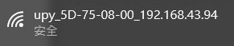
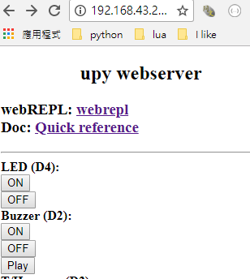
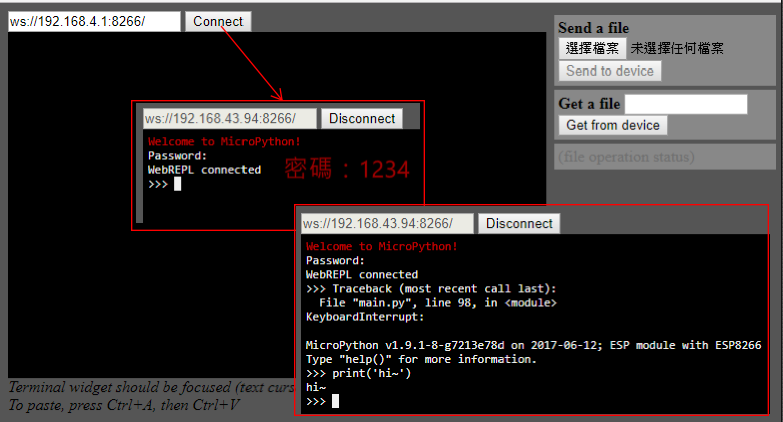

# MicroPython webtool

## 使用前的設定
- 在燒錄前，請先把ap.txt中的wifi SSID (第一行)、password(第二行)，改為你所在環境的wifi設定
- 這樣在燒錄後，uPy板子在上電後就會自動連上網路

## 上電後，連線測試
- 控制板上電後，約5~10秒可以看到「upy-5D-75-08-00_192.168.43.94」這樣以upy開頭的AP名稱。
  - 「upy-5D-75-08-00」為唯一序號 (教學時要貼在板子上)，這樣多人使用時就可以快速分辨出來
  - 後面接的IP代表控制板被分配的IP，是我們等一下測試時要連的IP
  
- 在瀏覽器上打上你的控制板IP
  - 以本文的例子輸入 http://192.168.43.94 , 可以看到網頁如圖
  
  - 請按畫面上的「LED ON」/「LED OFF」，確認你的控制板上的LED是否動作，若正常動作，代表連線正常
  
## micropython 函式的參考文件
- 參閱網頁中的「Quick reference」連結

## 網頁中寫程式
- 點「webREPL」的連結，得到畫面如圖

- 把圖中的IP改為「192.168.43.94」後，按「Connect」進行連線，請輸入密碼「1234」
- 因為web網頁韌體執行中，無法寫程式，請按「Ctrl^C」中斷之
- 再輸入「print('hi~')」可以得到「hi~」的輸出

